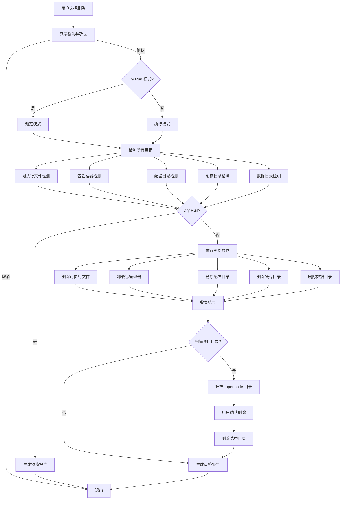

# Design Document: OpenCode Complete Uninstall

## Overview

本设计文档描述了 opencode 彻底删除功能的实现方案。该功能将扩展现有的 `create_doc.py` 脚本，添加完整的卸载能力，包括可执行文件清理、配置目录清理、缓存清理、项目目录扫描以及详细的清理报告。

## Architecture



## Components and Interfaces

### 1. PlatformDetector

负责检测当前操作系统并提供平台特定的路径。

```python
class PlatformDetector:
    def get_platform(self) -> str:
        """返回 'windows', 'macos', 或 'linux'"""
    
    def get_config_directories(self) -> List[str]:
        """返回配置目录路径列表"""
    
    def get_cache_directories(self) -> List[str]:
        """返回缓存目录路径列表"""
    
    def get_data_directories(self) -> List[str]:
        """返回数据目录路径列表"""
    
    def get_executable_extensions(self) -> List[str]:
        """返回可执行文件扩展名列表"""
```

### 2. ExecutableDetector

负责检测系统中的 opencode 可执行文件。

```python
class ExecutableDetector:
    def __init__(self, platform: PlatformDetector): pass
    
    def find_executables(self) -> List[str]:
        """查找所有 opencode 可执行文件路径"""
    
    def find_in_path(self) -> List[str]:
        """通过系统 PATH 查找"""
    
    def find_in_package_manager_dirs(self) -> List[str]:
        """在包管理器目录中查找"""
```

### 3. PackageManagerUninstaller

负责通过各种包管理器卸载 opencode。

```python
class PackageManagerUninstaller:
    def get_supported_managers(self) -> List[str]:
        """返回支持的包管理器列表"""
    
    def is_manager_available(self, manager: str) -> bool:
        """检查包管理器是否可用"""
    
    def uninstall(self, manager: str) -> UninstallResult:
        """执行卸载并返回结果"""
    
    def uninstall_all(self) -> List[UninstallResult]:
        """尝试所有包管理器"""
```

### 4. DirectoryCleaner

负责清理目录。

```python
class DirectoryCleaner:
    def find_directories(self, paths: List[str]) -> List[str]:
        """查找存在的目录"""
    
    def remove_directory(self, path: str) -> RemoveResult:
        """删除目录并返回结果"""
    
    def remove_directories(self, paths: List[str]) -> List[RemoveResult]:
        """批量删除目录"""
```

### 5. ProjectScanner

负责扫描项目中的 .opencode 目录。

```python
class ProjectScanner:
    def scan(self, root_path: str) -> List[str]:
        """扫描指定根目录下的所有 .opencode 目录"""
```

### 6. UninstallReport

负责生成和显示卸载报告。

```python
@dataclass
class UninstallReport:
    executables_removed: List[str]
    executables_failed: List[Tuple[str, str]]
    package_managers_success: List[str]
    package_managers_failed: List[Tuple[str, str]]
    config_dirs_removed: List[str]
    config_dirs_failed: List[Tuple[str, str]]
    cache_dirs_removed: List[str]
    data_dirs_removed: List[str]
    project_dirs_removed: List[str]
    is_complete: bool
    
    def display(self) -> None: pass
    def to_string(self) -> str: pass
```

### 7. OpenCodeUninstaller

主卸载器，协调所有组件。

```python
class OpenCodeUninstaller:
    def __init__(self, dry_run: bool = False): pass
    def run(self) -> UninstallReport: pass
    def confirm_with_user(self, message: str) -> bool: pass
    def prompt_for_input(self, message: str) -> str: pass
```

## Data Models

```python
@dataclass
class UninstallResult:
    target: str
    success: bool
    message: str
    error: Optional[str]

@dataclass
class RemoveResult:
    path: str
    success: bool
    error: Optional[str]

@dataclass
class PlatformPaths:
    config_dirs: List[str]
    cache_dirs: List[str]
    data_dirs: List[str]
    executable_extensions: List[str]
    package_manager_dirs: List[str]
```

## Correctness Properties

### Property 1: File Deletion Completeness
*For any* list of detected executable files, when deletion is executed, each file should either be successfully deleted or have a failure reason recorded.
**Validates: Requirements 1.2, 1.3**

### Property 2: Package Manager Attempt Coverage
*For any* set of supported package managers, the uninstaller should attempt each available one and record the result.
**Validates: Requirements 2.1, 2.3, 2.4**

### Property 3: Missing Package Manager Handling
*For any* package manager not installed, the uninstaller should skip it without error.
**Validates: Requirements 2.2**

### Property 4: User Confirmation Respect
*For any* configuration directory found, if user declines deletion it remains; if confirms it's removed.
**Validates: Requirements 3.2, 3.3, 3.4**

### Property 5: Platform Path Correctness
*For any* detected platform, paths returned should match expected standard locations.
**Validates: Requirements 7.2, 7.3, 7.4**

### Property 6: Dry Run Safety
*For any* operation in dry run mode, no files or directories should be deleted.
**Validates: Requirements 8.3, 8.4**

### Property 7: Report Completeness
*For any* completed uninstall, the report should contain entries for all attempted operations.
**Validates: Requirements 6.2, 6.3**

### Property 8: Project Directory Scan Completeness
*For any* directory tree, all .opencode directories under the root should be found.
**Validates: Requirements 5.3**

### Property 9: Continuation After Failure
*For any* failure during uninstall, processing should continue with remaining items.
**Validates: Requirements 1.3, 2.4, 4.4**

## Error Handling

- **Permission Denied**: 记录错误并继续
- **File Not Found**: 静默跳过
- **Command Not Found**: 静默跳过该包管理器
- **Keyboard Interrupt**: 优雅退出，显示已完成的操作

## Testing Strategy

使用 pytest 进行单元测试，hypothesis 进行属性测试。测试覆盖所有组件和正确性属性。
